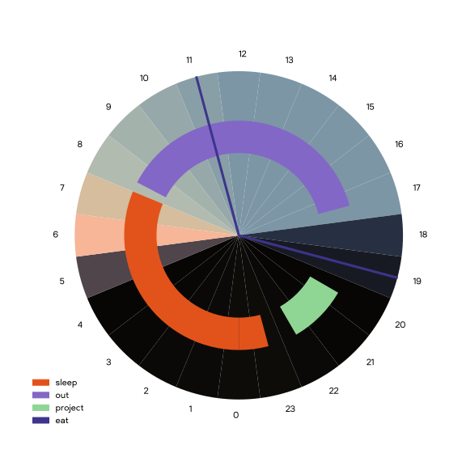

# daycircle

> [!NOTE]  
> daycircle is still in development and is not ready for use yet!  
> notably, aggregation of data spanning multiple day and last.fm integration is not yet implemented.

beautifully chart your average day over a period of time

```daycircle
day         20-10-2023
#sleep      E2531B
#out        8367C7
#project    8FD694
#eat        3D348B
sleep       0000-0730
out         0750-1700
@eat        1100
@eat        1900
project     2000-2200
sleep       2300-0000
```



## usage

point daycircle to a multiple [daycircle plaintext files](#daycircle-plaintext-file-format)
and it will work its magic.

```text
$ ls samples
25-10-2023  26-10-2023
$ daycircle samples/*
```

see [command-line usage](#command-line-usage) for more information.

### command-line usage

```text
usage: daycircle [-h] [-c COLOUR_FILE] [-o OUTPUT] [-t {png,svg,pdf}] [-f FONT] [targets ...]

beautifully chart your average day over a period of time

positional arguments:
  targets               the target daycircle plaintext file(s) to read from

options:
  -h, --help            show this help message and exit
  -c COLOUR_FILE, --colour-file COLOUR_FILE
                        a target daycircle plaintext with colours keys to use
  -o OUTPUT, --output OUTPUT
                        the output file or directory to write to
  -t {png,svg,pdf}, --output-type {png,svg,pdf}
                        the output format to use, overrides any file extension given to --output
  -f FONT, --font FONT  the font to use for the graph
```

### daycircle plaintext file format

daycircle plaintext files follow a simple key-value format:

```text
# psuedo-grammar

root     = metadata
         | key <whitespace> value
         ;

metadata = "day" <whitespace> date
         | "#" <string> <whitespace> rgbhex
         ;
key      = <string>
         | "@" <string>
         ;
value    = time           # single time for @<key> (marker) events
         | time "-" time  # time range for <key> (range) events
         ;
date     = <0-9> <0-9> "-"          # dd-
           <0-9> <0-9> "-"          # mm-
           <0-9> <0-9> <0-9> <0-9>  # yyyy
         ;
time     = <0-9> <0-9> <0-9> <0-9>  # 24h time format (e.g, 0000, 2359)
         ;
rgbhex   = <0-F> <0-F> <0-F> <0-F> <0-F> <0-F>  # 6-digit hex colour code
         ;
```

there are four types of keys:

1. **the metadata `day` key** (required)

   specifies the date of which the events took place.

   this key is not required to be the first key in the file, but it must be present.  
   for daycircle plaintext files that will be passed to `--colour-file`, this key will not
   be checked for, unlike files passed to the `targets` argument.

2. **the metadata colour key** (optional)

   specifies the 6-digit hex colour code to use as the primary colour when generating the
   output graph colour palette.

3. **the range event key** (optional)

   specifies a range of time in which the event took place.

   examples: sleeping, school, work, outside, etc.

4. **the marker event key** (optional)

    specifies a single point in time in which the event took place. this is useful for
    events that one would like to mark, but do not have a specific start and end time.

    example: eating
